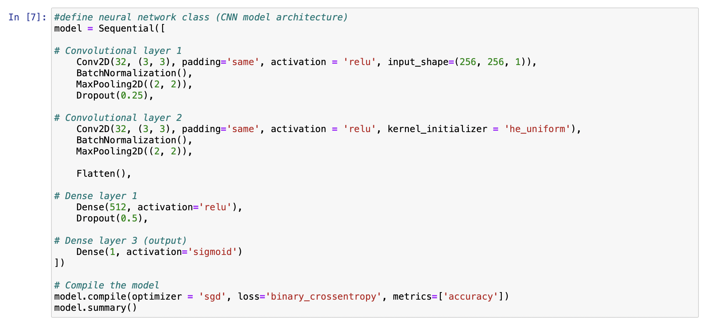
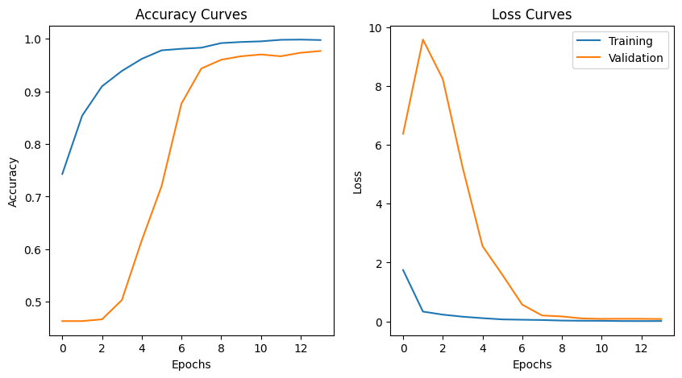
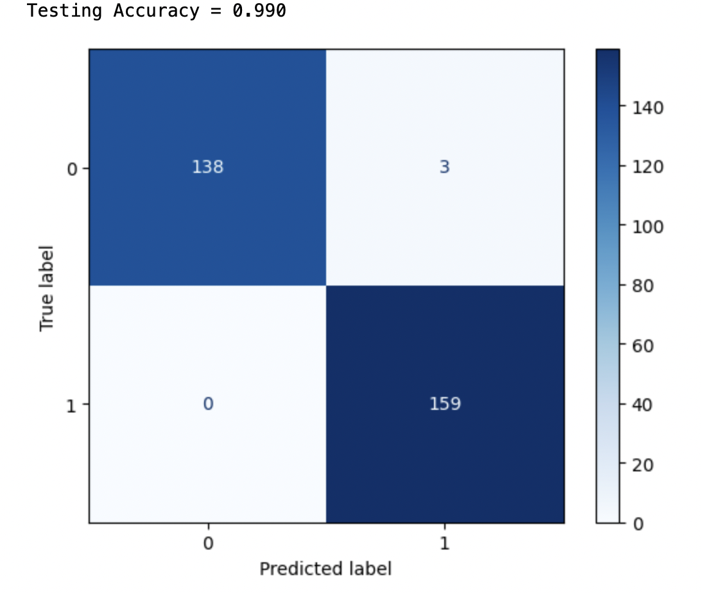
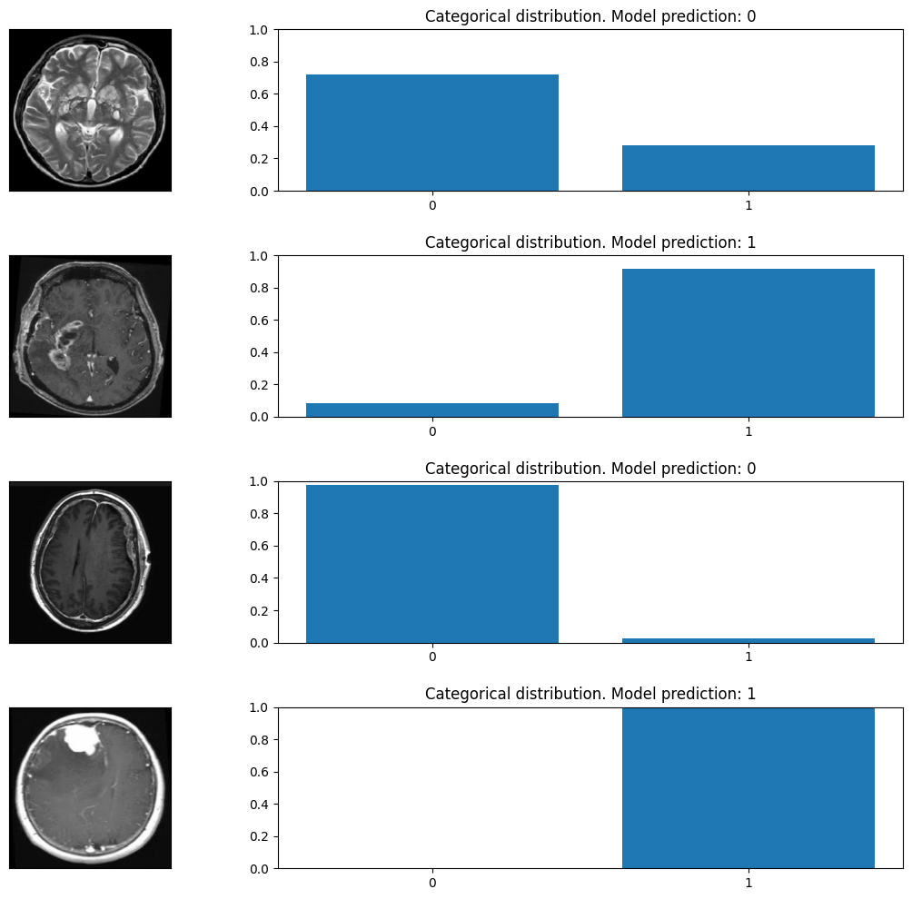

# Project Core Summary
In this project we worked to define a machine learning algorithm called convolutional neural network (CNN) to classify whether a MRI brain scan contains late-stage tumours. Our project core is to train a CNN model that classifies 2D images into either with tumours or without tumours to determine how accuracy can CNN be in recognizing abnormal MRI scans. For the project core, we used Brats MRI dataset containing 3000 images, in which we used 2400 for training our CNN model, 300 for validation during training, and 300 for testing performance. Dataset images are processed to be all grayscale with 256x256 pixels before feeding into Tensorflow CNN model during training. In the final epoch, it achieves 97.67% accuracy and 0.08 loss on validation dataset (training acc: 99.75%, loss: 0.0117). Then in model evaluation, CNN algorithm achieves 99% accuracy on 300 testing images. Our training and analysis used a global random seed of 147 to ensure reproducibility.

### CNN model architecture:
In total we used 11 layers including 2 Convolutional layers to extract visual information, 2 Maxpooling layers and Dropout layers to prevent overfitting and reduce computational loads. Then, images are flattened and connected to dense layer 1 with 512 neurons. The final output layer has only 1 neuron, in which an image will be classified as without tumour if final value is below 0.5, and vice versa. The model was compiled with SGD optimizer (lr=0.01) and binary cross entropy to calculate loss function during training. 

### Training with 2400 images over 14 epochs:
2400 images are fed into CNN to train for 14 epochs with batch size 32. The CNN model training converges quite quickly without vibrations. The final val_loss is really close to train loss (0.0137 vs 0.080, and the final validation accuracy is 97.67%.

### Visualise model evaluation result with confusion matrix (99% accuracy):
This image quantified successful and wrong classifications on testing images. Only 3 images are wrongly classified, and they are all false positive, which are desirable in tumour diagnosis!

### Visualise model decision making on several images. y-axis = relative confidence 0-1
This image visualises how our CNN made decisions on some of images. Y axis values represent model confidence on that choice. 
